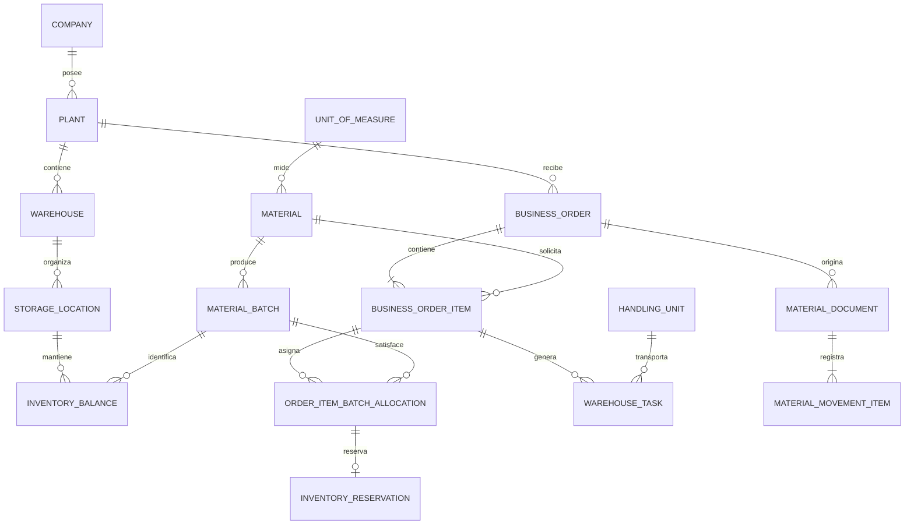

# Diagrama entidad-relación

## Llaves

- Las PK internas son `BIGSERIAL` y no contienen significado empresarial.
- Los códigos como `material_code`, `order_number` y `task_number` son llaves
  candidatas protegidas con `UNIQUE`.
- `inventory_balance` utiliza PK compuesta `(storage_location_id, batch_id)`.
- `business_order_item` utiliza `UNIQUE(order_id, line_number)`.
- Las referencias se realizan siempre mediante FK.

